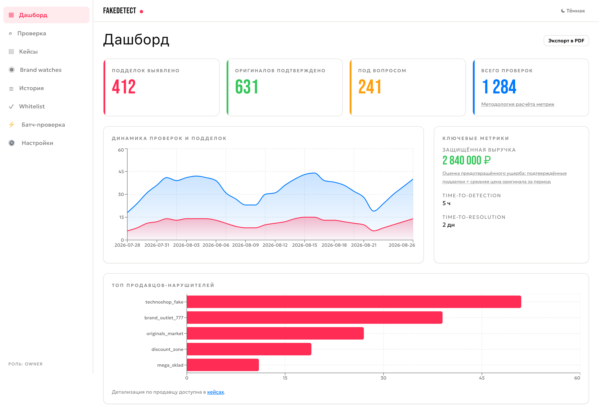
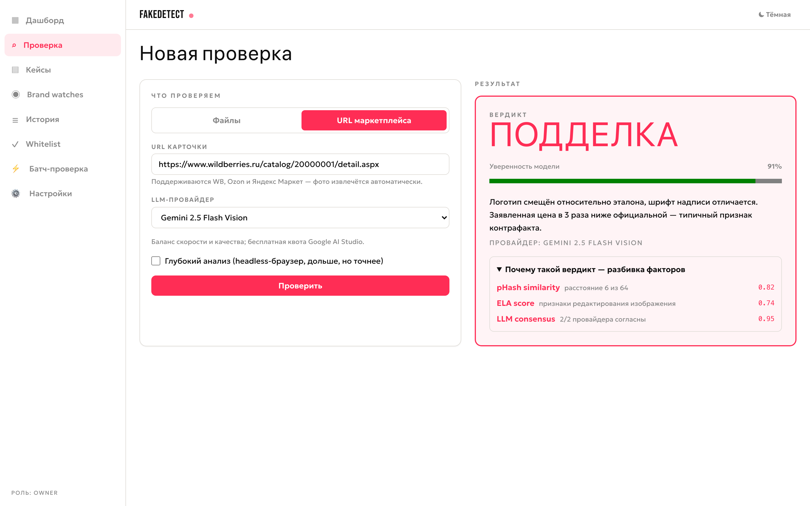
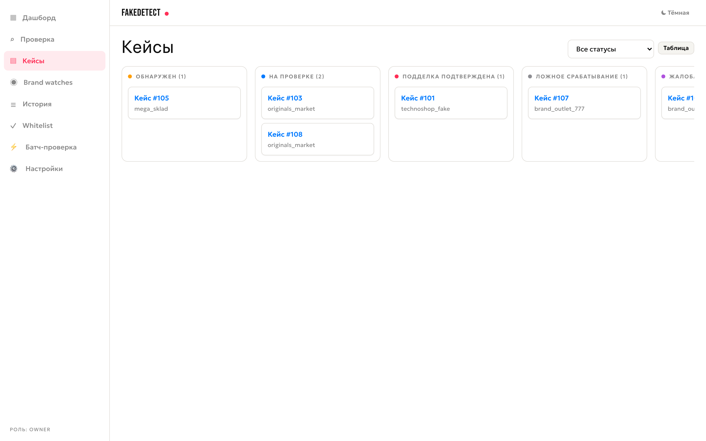
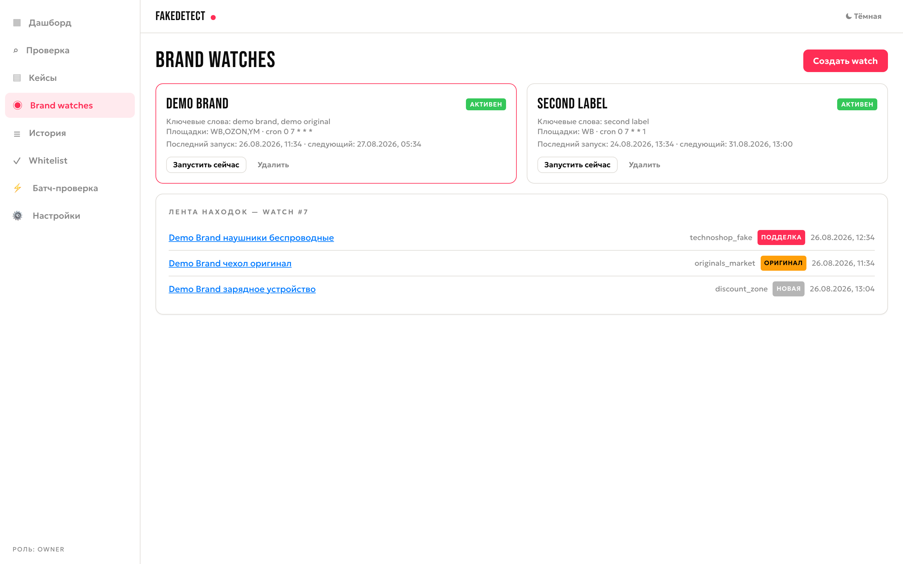

<div align="center">

# FakeDetect

**Платформа защиты бренда от контрафакта на маркетплейсах** (Wildberries, Ozon, Яндекс Маркет).

[](https://github.com/Ilyat9/FakeDetect/actions/workflows/ci.yml)
[](https://github.com/Ilyat9/FakeDetect/actions/workflows/frontend-ci.yml)


[](LICENSE)

</div>

## Зачем

Бренды теряют выручку из-за контрафакта, а ручной поиск подделок не масштабируется: карточек тысячи,
продавцы переезжают между площадками, для жалобы нужны доказательства, которые после факта уже не собрать.

**FakeDetect** закрывает весь цикл: находит подозрительные карточки по расписанию, выносит вердикт
с композитным скорингом (pHash + ELA/EXIF + консенсус LLM-визуальных моделей), ведёт кейс до закрытия,
собирает evidence-PDF с цепочкой доказательств и показывает руководителю защищённую выручку.

| | |
|---|---|
| Тесты | 178: 113 backend (pytest) + 65 frontend (Vitest/RTL/MSW), включая контрактные |
| API | 46 эндпоинтов `/api/v1` + OpenAPI (`/docs`) |
| Хранилище | 15 таблиц, SQLite с versioned-миграциями (слой готов под Postgres) |

## Скриншоты

| Дашборд | Вердикт |
|---|---|
|  |  |
| **Канбан кейсов** | **Brand watch** |
|  |  |

<details>
<summary>Как переснять скриншоты</summary>

Скриншоты генерируются скриптом с мок-данными (детерминированно, без реальных LLM-вызовов):

```bash
cd frontend
npm run dev &                          # или SHOT_BASE_URL на уже запущенный dev-сервер
node scripts/screenshots.mjs           # пишет в docs/screenshots/
```

</details>

## Быстрый старт

**Backend**

```bash
pip install -r requirements.txt
playwright install chromium        # для /analyze-deep и батчей
cp .env.example .env               # укажите GEMINI_API_KEY или GROK_API_KEY
uvicorn main:app --reload          # http://localhost:8000, Swagger — /docs
```

**Frontend (SPA)**

```bash
cd frontend && npm install && npm run dev   # http://localhost:5173, /api проксируется на :8000
```

**Docker (одной командой)**

```bash
docker compose up --build          # backend :8000, frontend :8080
```

Ключ Gemini — бесплатно на <https://aistudio.google.com>.

## Архитектура

```
FakeDetect/
├── main.py, server.py        # Сборка FastAPI-приложения; legacy-точка входа
├── core/                     # Конфигурация, security, circuit breaker, метрики
├── routers/                  # HTTP-слой (/api/v1): analysis, batch, data, cases,
│                             #   watches, analytics, billing, partner, system
├── services/                 # Бизнес-логика: tenancy, resilience, discovery,
│                             #   evidence, batch, scheduler, retry worker
├── parsers/                  # Парсеры WB / Ozon / Яндекс Маркет
├── forensics/                # pHash, ELA, EXIF-анализ изображений
├── aggregator.py             # Композитный вердикт (взвешенная сумма сигналов)
├── llm_provider.py           # Провайдеры: Gemini / Grok Vision
├── database.py               # SQLite + versioned-миграции (15 таблиц)
├── tests/                    # pytest: unit + integration
├── frontend/                 # SPA: React 19 + TS strict, Feature-Sliced, TanStack
├── docs/                     # ARCHITECTURE, COMPROMISES, CHANGELOG, DEPLOY, QUICKSTART,
│                             #   architecture-decisions, screenshots
├── Dockerfile                # Multi-stage образ (Playwright Chromium)
└── docker-compose.yml        # backend + frontend (nginx, /api same-origin)
```

## Как это работает

**1. Детекция.** Итоговый вердикт — взвешенная сумма нормированных сигналов «подлинности» (0–100),
каждый из которых виден в API и в UI («почему такой вердикт»):

| Сигнал | Вес | Что ловит |
|---|---|---|
| `llm_confidence` (Gemini / Grok Vision) | 0.45 | визуальное расхождение с эталоном |
| `phash_similarity` | 0.25 | копии-переклейки логотипа |
| ELA | 0.15 | ретушь и склейку изображений |
| `price_ratio` | 0.10 | аномально низкую цену |
| EXIF-флаги | 0.05 | следы Photoshop/GIMP, удалённые метаданные |

Пограничная уверенность (40–70%) автоматически запускает второго провайдера. Мнения совпали —
уверенность усиливается; разошлись — вердикт уходит человеку со статусом «требует ручной проверки»,
оба сырых ответа сохраняются для аудита.

**2. Автономный мониторинг.** Brand watch по cron-расписанию ищет новые карточки бренда на выбранных
площадках, дедуплицирует по URL/SKU и прогоняет находки через детекцию. Настройка — без ручного cron:
в UI выбирается частота, на бэкенде она превращается в расписание. Дайджесты — в Telegram.

**3. Кейсы.** Проверка с вердиктом ≠ «оригинал» автоматически открывает кейс (один check = один case):

```
DETECTED → UNDER_REVIEW → CONFIRMED_FAKE / FALSE_POSITIVE →
COMPLAINT_FILED → LISTING_REMOVED → CLOSED
```

Недопустимые переходы отклоняются с подсказкой, каждый шаг пишется в журнал аудита (кто/когда/комментарий).
На каждый статус — SLA-лимит (DETECTED 24ч, UNDER_REVIEW 72ч…); просрочки эскалируются в Telegram.
Evidence-PDF собирается на момент обнаружения: скриншот карточки, side-by-side сравнение, форензика,
история цен, цепочка хранения артефактов. Плюс готовый текст жалобы под конкретную площадку.

**4. Надёжность.**

| Механизм | Что даёт |
|---|---|
| Circuit breaker | 5 ошибок подряд → провайдер исключается, трафик идёт на второй (gemini↔grok) |
| Идемпотентность | повтор с тем же `X-Request-ID` возвращает кэш — LLM не оплачивается дважды |
| Retry queue | все провайдеры недоступны → 202 + polling, фоновый воркер доигрывает сам |
| Timeout budget | весь путь запроса укладывается в SLA, иначе 504 + Retry-After |
| Token bucket | превентивный троттлинг под квоту API |
| Observability | JSON-логи с request_id, `/metrics` (Prometheus), детальный `/health` |

**5. Мульти-тенантность и роли.** Изоляция по `tenant_id` на уровне SQL. Ключ `X-API-Key`
определяет тенант и роль:

| Действие | Минимальная роль |
|---|---|
| Чтение history/stats/cases/evidence | viewer (+ `legal` для кейсов) |
| Запуск анализов, переходы статусов, комментарии | analyst |
| Whitelist, brand watches, просроченные SLA | admin |
| API-ключи, план биллинга | owner |

Квоты тарифов (free/pro/business: 100/2000/20000 проверок в месяц) проверяются до дорогого
LLM-вызова — при превышении 402 с подсказкой об апгрейде. Биллинг-вебхуки Stripe/ЮKassa
с проверкой подписи и анти-replay. Партнёрский контур `/api/v1/partner/*` — только по ключам,
per-key rate limit.

## API

Полная схема — `/docs` (Swagger). Основные группы:

| Группа | Эндпоинты |
|---|---|
| Анализ | `POST /analyze`, `POST /analyze-deep`, `POST /parse-image` |
| Батч | `POST /batch`, `GET /batch/{id}`, `GET /batch/{id}/download` |
| Данные | `GET /history`, `GET /stats`, `GET/POST/DELETE /whitelist` |
| Кейсы | `GET /cases`, `POST /cases/{id}/transition`, `/bulk-transition`, `/comments`, `/evidence-pdf`, `/complaint` |
| Мониторинг | `POST/GET/DELETE /watches`, `/watches/{id}/listings`, `/run-now` |
| Аналитика | `/analytics/timeseries`, `/top-sellers`, `/revenue`, `/timing`, `/summary`, `/export.pdf`, `/export.pptx` |
| Биллинг | `/billing/webhook/{stripe\|yookassa}`, `/billing/plans/{tenant_id}` |
| Партнёрский | `/partner/checks`, `/partner/checks/{rid}`, `/partner/stats` |
| Служебные | `/health`, `/metrics`, `/queue/{request_id}` |

## Конфигурация

Основные переменные (полный список — `.env.example`):

| Переменная | Назначение |
|---|---|
| `GEMINI_API_KEY` / `GROK_API_KEY` | Ключи LLM-провайдеров |
| `API_SECRET_KEY` | Задан → требуется `X-API-Key`; не задан → open-mode (owner Default-тенанта) |
| `ALLOWED_ORIGINS` | CORS-источники (пусто = только same-origin) |
| `DB_PATH` | Путь к SQLite (в Docker — `/data/fakedetect.db`) |
| `LOG_FORMAT=json` | Структурные логи для продакшена |

## Документация

| Файл | Содержимое |
|---|---|
| [docs/ARCHITECTURE.md](docs/ARCHITECTURE.md) | Архитектура, надёжность, пути масштабирования |
| [docs/architecture-decisions.md](docs/architecture-decisions.md) | Обоснование ключевых решений |
| [docs/COMPROMISES.md](docs/COMPROMISES.md) | Реестр упрощений и план их устранения |
| [docs/CHANGELOG.md](docs/CHANGELOG.md) | История изменений по блокам |
| [docs/DEPLOY.md](docs/DEPLOY.md) | Деплой: VPS+Caddy, Render/Railway |
| [docs/QUICKSTART.md](docs/QUICKSTART.md) | Краткая шпаргалка запуска |
| [frontend/README.md](frontend/README.md) | Архитектура SPA, команды, API-contract workflow |

## Разработка

```bash
pytest -v                                    # backend-тесты
cd frontend
npm test                                     # unit/component/contract (Vitest + MSW)
npm run test:e2e                             # Playwright smoke
npm run storybook                            # дизайн-система на :6006
node scripts/screenshots.mjs                 # скриншоты для README (нужен dev-сервер)
```

CI на каждый push/PR: backend (pytest + ruff) и frontend (lint, typecheck, тесты, build,
Storybook, drift-check OpenAPI-типов против живого бэкенда, Lighthouse, E2E Playwright).

## Roadmap

- [ ] Поддержка Авито и AliExpress
- [ ] Telegram-бот: отправил ссылку — получил результат
- [ ] Postgres + Row-Level Security (после стабилизации схемы тенантов)

## Лицензия

[MIT](LICENSE)

